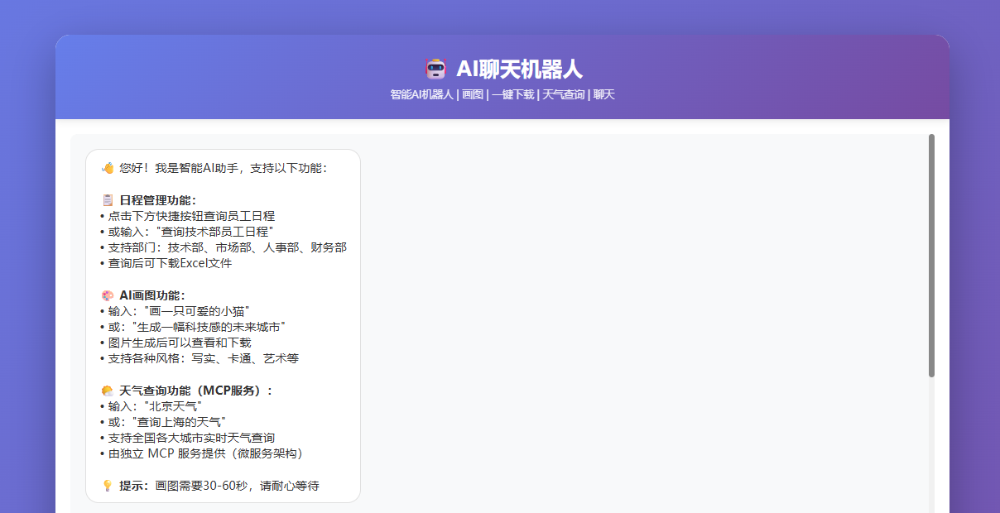
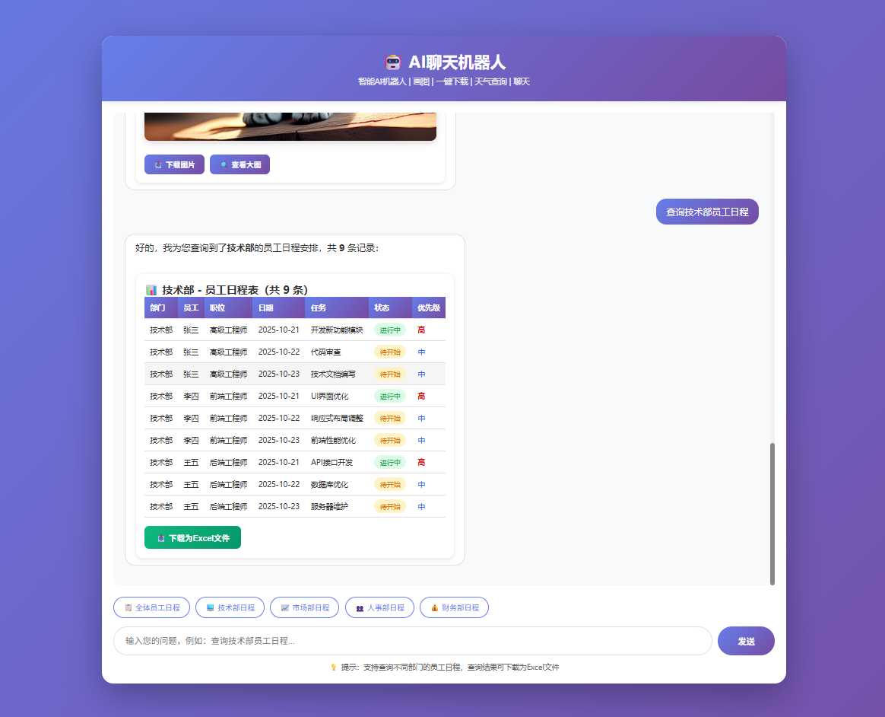
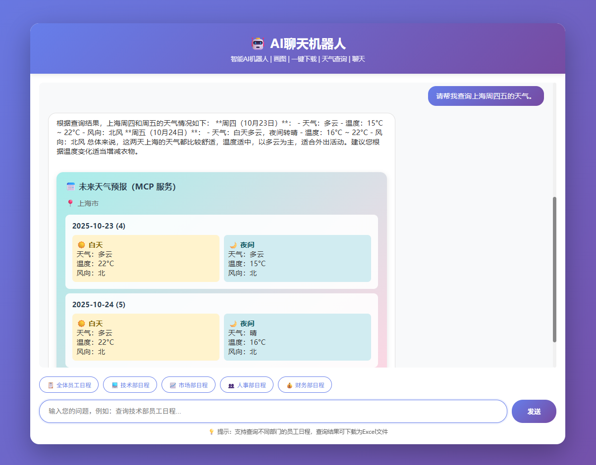
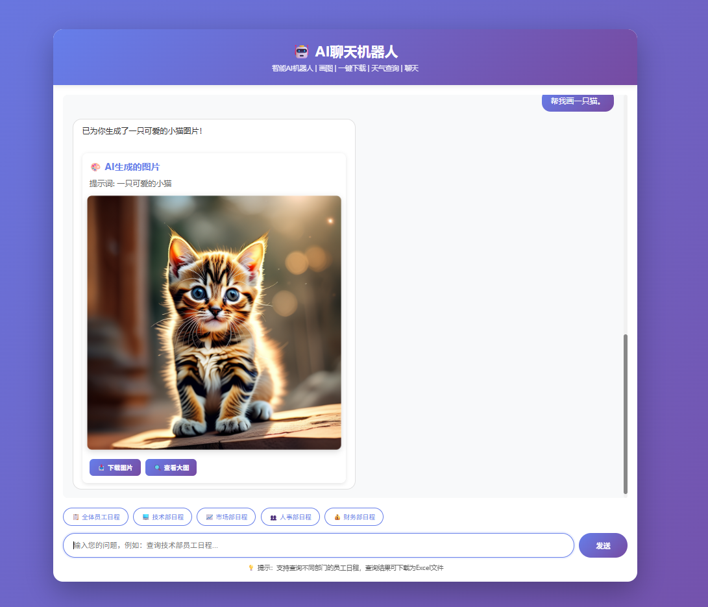

# AI 聊天机器人（MCP 微服务架构）

基于 LangChain + DeepSeek + FastMCP 的智能聊天机器人，支持日程管理、AI 画图和天气查询功能。

---

## 📸 功能演示

### 开始页面


### 日程查询


### 天气查询


### AI 画图（千问）


### 其他功能


---

## ⚡ 快速开始

### 步骤 1：安装依赖

```bash
# 安装主应用依赖
pip install -r requirements.txt

# 安装 MCP 服务依赖
cd mcp_weather_service
pip install -r requirements.txt
cd ..
```

### 步骤 2：配置 API Key

**必需配置：**

1. **DeepSeek API Key**（用于 AI 对话）
   
   创建 `.env` 文件，填入：
   ```
   DEEPSEEK_API_KEY=sk-xxxxxxxxxxxxx
   ```
   > 获取地址：https://platform.deepseek.com/

2. **高德地图 API Key**（用于天气查询功能）
   
   编辑 `mcp_weather_service/fastmcp_server.py`，修改第 17 行：
   ```python
   AMAP_API_KEY = "your_amap_api_key_here"
   ```
   > 获取地址：https://lbs.amap.com/

3. **千问 API Key**（用于 AI 画图功能）
   
   编辑 `config.json`，填入：
   ```json
   {
     "tongyi": {
       "api_key": "sk-xxxxxxxxxxxxx",
       ...
     }
   }
   ```
   > 获取地址：https://dashscope.aliyun.com/

**无需配置：**

- ✅ **日程管理**：本地模拟数据，无需配置，正常可以调用知识库或者API接口查询数据，这里主要模拟。

### 步骤 3：启动服务

**终端 1 - 启动 MCP 天气服务：**
```bash
cd mcp_weather_service
python fastmcp_server.py --sse
```

**终端 2 - 启动主应用：**
```bash
python app.py
```

**终端 3 - 打开前端：**

双击 `index.html` 文件，或在浏览器（CTRL+O）打开。

### 步骤 4：开始使用

试试这些命令：
- "查询技术部的日程"
- "北京今天天气怎么样"
- "画一只可爱的猫"（需要千问 API Key）

---

## 📐 系统架构

```
┌─────────────────────────────────────────────────────────────┐
│                   前端 (index.html)                          │
│                用户界面 + 交互 + 卡片展示                      │
└────────────────────────┬────────────────────────────────────┘
                         │ HTTP/AJAX
                         ▼
┌─────────────────────────────────────────────────────────────┐
│              主应用服务 (app.py:5000)                         │
│              Flask + LangChain + DeepSeek                    │
│  ┌────────────┐  ┌────────────┐  ┌────────────┐             │
│  │  日程工具   │  │  画图工具   │  │  天气工具   │             │
│  │  (本地)    │  │ (千问API)  │  │ (MCP调用)  │             │
│  └────────────┘  └────────────┘  └──────┬─────┘             │
└───────────────────────────────────────────┼─────────────────┘
                                            │ MCP 协议 (SSE)
                                            ▼
                         ┌──────────────────────────────────┐
                         │   MCP 客户端 (mcp_client.py)      │
                         │      封装 MCP SSE 通信             │
                         └──────────────┬───────────────────┘
                                        │ SSE 长连接
                                        ▼
                         ┌──────────────────────────────────┐
                         │ MCP 天气服务 (fastmcp_server.py)  │
                         │        端口: 8001 (SSE 模式)       │
                         │  ┌──────────────────────────┐     │
                         │  │ query_current_weather     │     │
                         │  │ query_weather_forecast    │     │
                         │  └──────────┬───────────────┘     │
                         └─────────────┼─────────────────────┘
                                       │ HTTP API
                                       ▼
                         ┌──────────────────────────────────┐
                         │      高德地图天气 API              │
                         └──────────────────────────────────┘
```

**特点**：
- ✅ 标准 MCP 协议，SSE 长连接通信
- ✅ 微服务架构，天气服务独立部署
- ✅ 支持远程调用，可跨机器部署

---

## 📁 项目结构

```
cursor-web-project/
├── app.py                      # 主应用服务（Flask + LangChain Agent）
├── mcp_client.py               # MCP 客户端（SSE 长连接）
├── index.html                  # 前端页面
├── requirements.txt            # 主应用依赖
├── config.json                 # 画图配置（千问 API）
├── .env                        # 环境变量（DeepSeek API Key）
│
├── mcp_weather_service/        # MCP 天气服务目录
│   ├── fastmcp_server.py       # FastMCP 服务器（SSE 模式）
│   └── requirements.txt        # MCP 服务依赖
│
└── generated_images/           # AI 生成的图片存储目录
```

---

## 🔌 端口分配

| 服务            | 端口  | 说明                          |
|-----------------|-------|-------------------------------|
| 主应用 (Flask)  | 5000  | AI Agent + API 接口           |
| MCP 天气服务    | 8001  | FastMCP 服务器（SSE 模式）     |

---

## 💡 使用示例

**日程查询：**
```
查询技术部的员工日程
查询全体员工的工作安排
```

**AI 画图：**
```
画一个大黄蜂机器人
生成一个赛博朋克风格的未来城市
```

**天气查询：**
```
北京天气
上海今天天气怎么样
查询广州未来3天的天气
```

**普通对话：**
```
帮我写一段 Python 代码
解释一下什么是 MCP 协议
```

---

## 🛠️ 技术栈

- **后端**: Flask + LangChain
- **大模型**: DeepSeek API
- **MCP 协议**: FastMCP (SSE 传输)
- **画图**: 千问（通义万相）API
- **前端**: HTML + JavaScript + CSS

---
